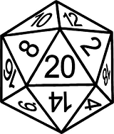
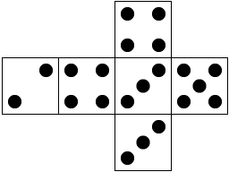
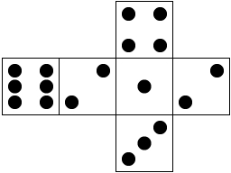

# NDice

Dice toolkit for .Net. Included are some novel dice implementations for .Net. 

## Installation

```C#
dotnet add package NDice
// OR
install-Package NDice
```

## How To Use (tl;dr)

```C#
var die = new Die(); // Creates a new six-sided die

int result = die.Roll();
```

## Types of Dice

### `Die`

A fair die. It is not weighted, and as random as its randomizer can be.

### `WeightedDie`

Die with one or more sides weighted to have a higher probablility of occurrence.

### `GamblersDie`

Weighted die that obeys the [Gambler's Fallacy](https://github.com/xori/gamblers-dice). The weight shifts after each roll, so that the longer a side has not been rolled, the higher its probability of occurrence for the next roll.

### `TappersDie`

A [tapper's die](http://www.dice-play.com/DiceCrooked.htm) behaves like a fair die, until it is tapped. Then it behaves like a weighted die until it is tapped again.

## Examples

Dice can be constructed with a default of six sides, or any number of sides:

```C#
var fairDie = new Die();

var weightedDie = new WeightedDie();

var bigFairDie = new Die(225);
```

> NOTE: Most types of weighted dice constructed with no weights will behave like a fair die

`WeightedDie` and dice derived from it (e.g. `GamblersDie`) can be constructed with weights for each side, using a series of numbers or an array. 

> Percentages can be used, but the total weight must equal 1. Try to use nicely dividable percentages, otherwise some precision may be lost. 

```C#
// Six-sided die with side 4 heavily weighted
var luckyFour = new WeightedDie(1, 1, 1, 5, 1, 1);

int probablyFour = luckyFour.Roll();
int alsoProbablyFour = luckyFour.Roll();

// Ten-sided gambler's die, with side 2 heavily weighted
int[] weights = new int[] { 1, 5, 1, 1, 1, 1, 1, 1, 1, 1 };
var firstRollLikelyTwo = new GamblersDie(weights);

int likelyTwo = firstRollLikelyTwo.Roll();
int likelyAnythingButTwo = firstRollLikelyTwo.Roll();

double[] percentWeights = new double(0.125, 0.125, 0.5, 0.125, 0.125);
var percentWeightedDie = new WeightedDie(percentWeights);
```

## `IRandomizable`

By default `System.Random` is used to roll the die, but a generic interface `IRandomizable` can be implemented and used with any die. Below is a terrible randomizer that uses the current time to generate a "random" number.

```C#
public class SecondsRandomizable : IRandomizable
{
    public int Get(int maxValue)
    {
        int.TryParse(DateTime.Now.ToString("ss"), out int seconds);

        return seconds % maxValue;
    }
}
```

And it can be used as the first parameter when constructing a die:

```C#
var rnd = new SecondsRandomizable();

var die0 = new Die(rnd, 8);

var die1 = new WeightedDie(rnd, 1, 1, 1, 7, 1, 1, 1);

var die2 = new GamblersDie(rnd, 20);
```

## `DieLabeler`

All dies roll numbers, `DieLabeler<TLabel>` can be used to roll objects instead of numbers.  
Numbers are mapped to objects by `DieLabeler<TLabel>` using a dictionary where each key-value pair represents a number and the object mapped to that number.  
By default any missing number to object mapping will return `default(TLabel)`, otherwise `DieLabeler<TLabel>` can be configured to throw exceptions for missing mappings.  

To use `DieLabeler<TLabel>` construct a new instance and pass it the number to label mappings and an instance of `IDie`.  
Below an example usage of the `DieLabeler` with labels of type `string`:  

```C#

Dictionary<int, string> labels = new Dictionary<int, string>
{
	{1, "One" },
	{2, "Two" },
	{3, "Three" },
	{4, "Four" },
	{5, "Five" }
	{6, "Six" }
};

Die aDie = new Die();

DieLabeler<string> labeledDie = new DieLabeler<string>(aDie, labels);

string result = labeledDie.Roll();

```

## Real World Examples

Die | Code
:-: | -
D20<br> | <pre>var d20 = new Die(20);</pre>
[Average Die<br>](https://em4miniatures.com/index.php/catalogsearch/result/?q=+average+dice) | <pre>var avgDie = new WeightedDie(1, 2, 2, 1);<br>int[] sides = new int[] { 2, 3, 4, 5 };<br><br>// Roll the die, then get the value<br>avgDie.Roll();<br>int rolledSide = sides[avgDie.Current];
Double Deuce<br> | <pre>var d2Die = new WeightedDie(1, 2, 1, 1, 1);<br>int[] sides = new int[] { 1, 2, 3, 4, 6 };<br><br>// Roll the die, then get the value<br>d2Die.Roll();<br>int rolledSide = sides[d2Die.Current];

## Future Work

- [ ] More real world examples
- [x] Percentages/ratios for weight
- [ ] Include common dice like the examples (another package)
- [x] Built-in labels
- [ ] Fluent die builder
- [x] Abstraction for randomizer, so other libs/algorithms may be used
- [ ] Extension package for other implementations of `IRandomizable` 
- [ ] More dice algorithms! (statisticians/dice enthusiasts needed. PRs welcome)

## Acknowledgements

This wouldn't have been made if not for stumbling upon [xori/gamblers-dice](https://github.com/xori/gamblers-dice).
